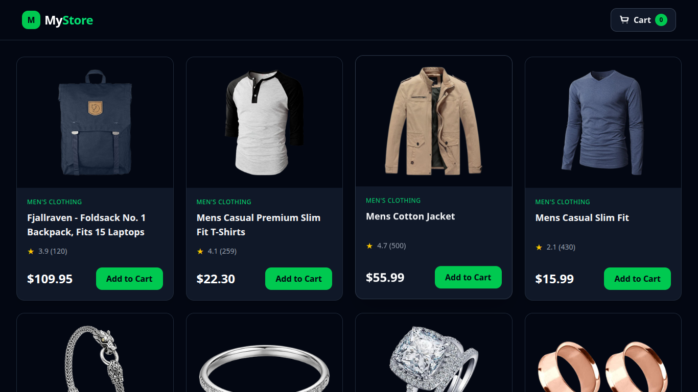
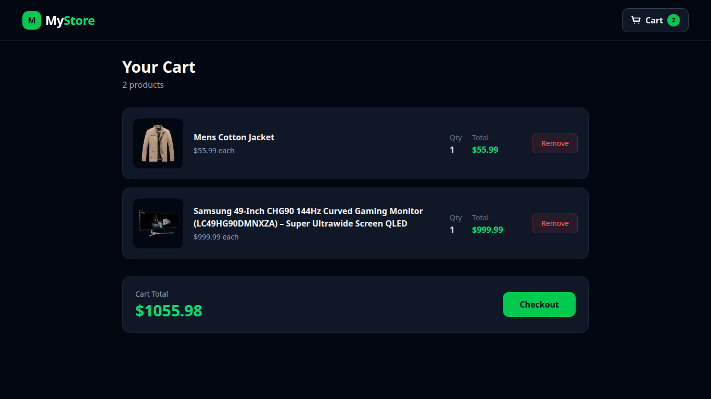
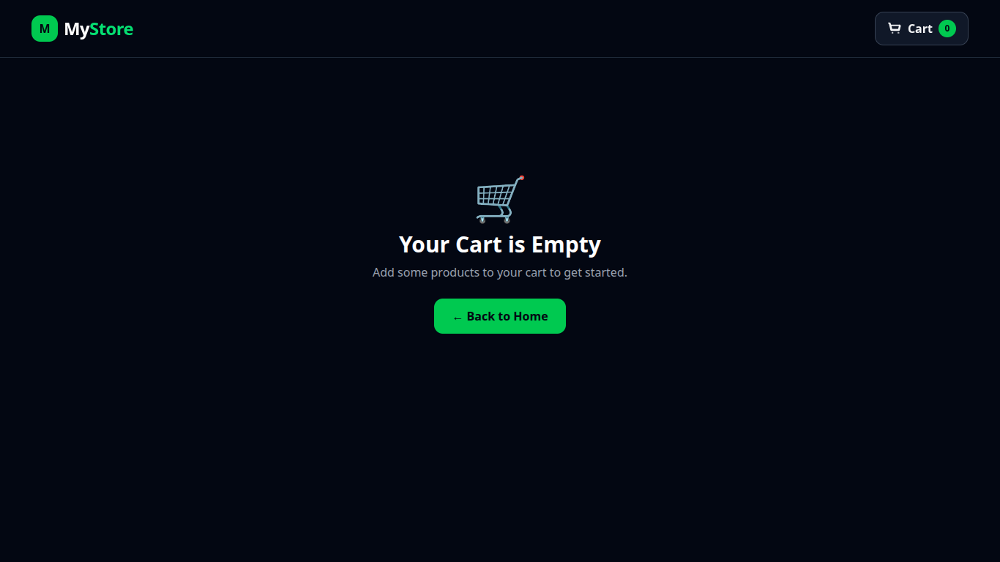

# 🛒 My Store

A modern e-commerce frontend built with **React, Context API, React Router, Axios, and Tailwind CSS**.

This project was created to practice managing global state, client-side routing, API integration, and building a responsive shopping cart experience.

---

## 🚀 Live Project

Currently running locally. GitHub is being used for source-code version control.

---

## 📸 Screenshots

### 🏠 Home / Product Listing



### 🛍️ Products



### 🛒 Shopping Cart



---

## ✨ Features

- 🛍️ Product listing
- 🛒 Add products to cart
- ➕ Increase quantity when an existing product is added again
- 🗑️ Remove products from cart
- 🔢 Dynamic cart item count
- 💰 Dynamic cart total
- 🔔 "Item added to cart" notification
- ⭐ Product ratings
- 📱 Responsive product grid
- 🌙 Dark-themed UI
- 🧭 Client-side routing
- 🌐 Product data fetched from an external API
- 📦 Global cart state using React Context API

---

## 🧠 What I Learned

### 1. React Context API

I learned how to use the Context API to manage global state without passing props through multiple components.

The cart state is shared between components such as:

- `Navbar`
- `ProductCard`
- `Cart`

The main context provides:

```javascript
cart;
addToCart();
removeFromCart();
getCartCount();
getCartTotal();
```

This allowed different components to access and modify cart data without prop drilling.

---

### 2. Custom Hooks

I created a custom `useCart()` hook:

```javascript
export function useCart() {
  return useContext(ContextCart);
}
```

Instead of writing:

```javascript
useContext(ContextCart);
```

throughout the application, components can simply use:

```javascript
const { cart, addToCart } = useCart();
```

This makes the code cleaner and easier to maintain.

---

### 3. Cart State Management

I learned how to update arrays inside React state using the functional state update pattern:

```javascript
setCart((prevCart) => {
  // update cart
});
```

I also learned how to check whether a product already exists in the cart:

```javascript
item.id === product.id;
```

If the product already exists, its quantity is increased:

```javascript
{
  ...item,
  quantity: item.quantity + 1
}
```

If it doesn't exist, the product is added with:

```javascript
{
  ...product,
  quantity: 1
}
```

---

### 4. Derived State

Instead of storing the cart count and total separately, I learned how to calculate them from the cart state.

**Cart count:**

```javascript
cart.reduce((total, item) => total + item.quantity, 0);
```

**Cart total:**

```javascript
cart.reduce((total, item) => total + item.price * item.quantity, 0);
```

This prevents duplicated state and keeps the application data consistent.

---

### 5. React Router

I learned how to create different pages/routes in a React application.

For example:

```text
/
└── Home

/cart
└── Cart
```

React Router allows navigation between these views without performing a full browser page reload.

---

### 6. Axios & API Integration

I learned how to fetch product data from an external API using Axios:

```javascript
const response = await axios.get("https://fakestoreapi.com/products");
```

The returned product data is then stored in React state:

```javascript
setProducts(response.data);
```

---

### 7. useEffect

I learned how to perform the API request when the application loads:

```javascript
useEffect(() => {
  getProducts();
}, []);
```

The empty dependency array means the effect runs when the component mounts.

---

### 8. Responsive UI with Tailwind CSS

I used Tailwind CSS to build the interface without writing large amounts of custom CSS.

The product grid adapts to different screen sizes using responsive utility classes.

---

### 9. Component-Based Architecture

I learned how to break the application into smaller, reusable components:

```text
src/
├── components/
│   ├── Cart.jsx
│   ├── Navbar.jsx
│   ├── ProductCard.jsx
│   └── ProductList.jsx
│
├── context/
│   └── CartContext.jsx
│
├── assets/
│   └── newfavicon.png
│
├── App.jsx
├── index.css
└── main.jsx
```

Each component has a specific responsibility, making the project easier to understand and maintain.

---

## 🛠️ Technologies Used

- **React**
- **JavaScript**
- **React Context API**
- **React Router**
- **Axios**
- **Tailwind CSS**
- **Vite**
- **Git**
- **GitHub**

---

## 📡 API

Product data is provided by:

**Fake Store API**

```text
https://fakestoreapi.com/products
```

The API is used to retrieve product information displayed in the application.

---

## 📦 Installation

### 1. Clone the repository

```bash
git clone https://github.com/subhajitcodes/my-store.git
```

### 2. Move into the project directory

```bash
cd my-store
```

### 3. Install dependencies

```bash
npm install
```

### 4. Start the development server

```bash
npm run dev
```

The application will be available at the local URL provided by Vite.

---

## 📁 Project Structure

```text
my-store/
│
├── public/
│
├── screenshots/
│   ├── home.png
│   ├── products.png
│   └── cart.png
│
├── src/
│   ├── assets/
│   │   └── newfavicon.png
│   │
│   ├── components/
│   │   ├── Cart.jsx
│   │   ├── Navbar.jsx
│   │   ├── ProductCard.jsx
│   │   └── ProductList.jsx
│   │
│   ├── context/
│   │   └── CartContext.jsx
│   │
│   ├── App.jsx
│   ├── index.css
│   └── main.jsx
│
├── index.html
├── package.json
├── package-lock.json
└── vite.config.js
```

---

## 🎯 Main Learning Goals

The main purpose of this project was to understand how different React concepts work together:

```text
React
  ↓
Components
  ↓
State Management
  ↓
Context API
  ↓
Custom Hooks
  ↓
React Router
  ↓
API Integration
  ↓
Responsive UI
```

---

## 🔮 Future Improvements

Some features I would like to add in the future:

- 🔐 User authentication
- 💳 Payment integration
- 🔍 Product search
- 🏷️ Product filtering
- 📊 Product sorting
- ❤️ Wishlist
- 💾 Persistent cart using `localStorage`
- 🛍️ Product details page
- 📦 Order history
- 🔔 Better toast notifications
- ⚡ Loading and error states
- 🧪 Unit and integration tests

---

## 👨‍💻 Author

**Subhajit**

Built while learning and practicing modern React development.

---

⭐ If you find this project useful, feel free to explore the code and experiment with it.
